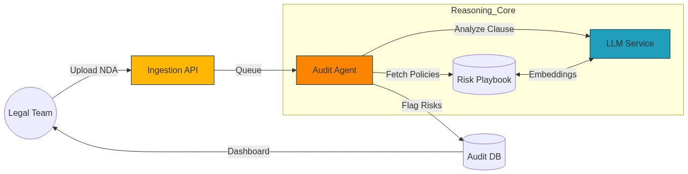
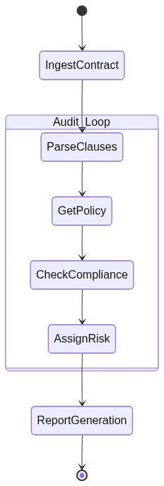

# Autonomous Legal Contract Auditor ⚖️


A production-grade AI agent that automatically audits contracts (NDAs, MSAs) against a predefined "Risk Playbook" using RAG and LLMs. This system parses legal documents, retrieves relevant corporate policies, and assigns a risk score to every clause.

> **Research POC**: This project explores how Agents can reduce legal review time by 90% and ensure 100% compliance with corporate risk standards.

## 🏗️ Architecture



The system is built on a modular architecture:
1.  **Ingestion Layer**: Parses PDF contracts and OCRs text (simulated).
2.  **Risk Engine (RAG)**: A vector database of "Risk Policies" (e.g., "Indemnification must be mutual").
3.  **Audit Agent (LLM)**: Comparison engine that reasons whether a clause meets the policy criteria.

## 🚀 Key Features

- **Automated Clause Compliance**: Checks clauses against strict "Risk Playbooks".
- **Risk Scoring**: Assigns a 0-100 risk score to documents based on non-standard terms.
- **Explainable Findings**: Provides a clear "Why" for every flag (e.g., "Rejected: One-sided").
- **Real-time Terminal Output**: Hyper-realistic CLI simulation of the audit process.

## 🛠️ Usage

```bash
# Clone the repository
git clone https://github.com/aniket-work/autonomous-legal-contract-auditor.git
cd autonomous-legal-contract-auditor

# Install dependencies
pip install -r requirements.txt

# Run the Auditor
python main.py
```

## 📊 Logic Flow



## 📁 Project Structure

```
├── main.py                 # CLI Entry point & Orchestration
├── risk_engine.py          # Vector Database Simulation (Policies)
├── auditor.py              # LLM Reasoning Engine
├── generate_diagrams.py    # Mermaid.js Asset Generator
├── generate_gif.py         # Terminal Animation Generator
└── images/                 # Generated Visual Assets
```

## ⚠️ Disclaimer

This is an experimental Proof of Concept (PoC) for educational purposes. It is not intended for use in actual legal practice. Always consult a qualified attorney for legal contracts.
